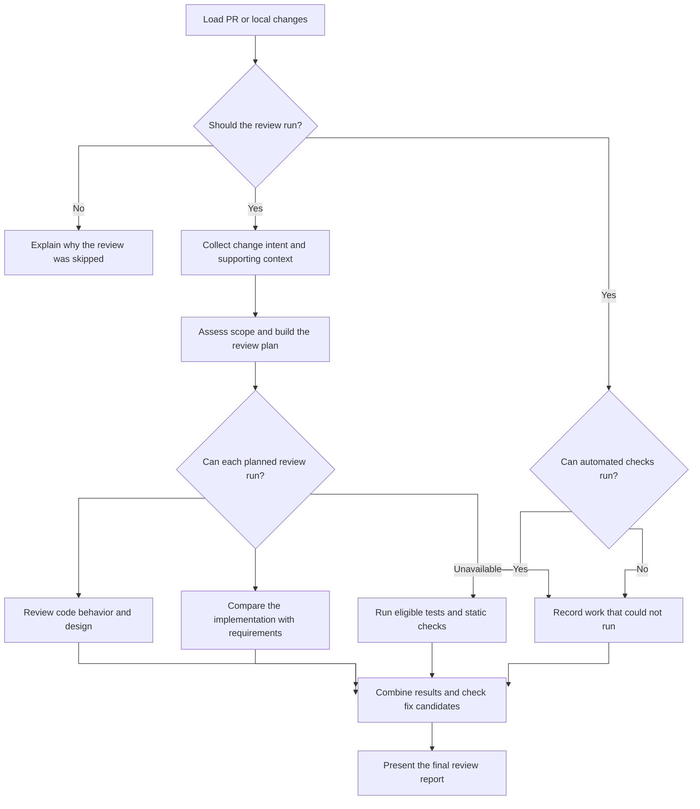

# Review PR Plugin

<!-- English | [日本語](docs/README.ja.md) | [简体中文](docs/README.zh-CN.md) -->

An evidence-based review workflow for local changes and GitHub pull requests.
The reusable workflow lives in `skills/review-pr/`; native plugin manifests make
it available to supported coding agents without making the review behavior
depend on any single agent.

## Table of Contents

- [1. Overview](#1-overview)
- [2. Agent Compatibility](#2-agent-compatibility)
- [3. Architecture](#3-architecture)
  - [Directory Structure](#directory-structure)
  - [Review Workflow](#review-workflow)
- [4. Use the Skill](#4-use-the-skill)
- [5. Install or Develop](#5-install-or-develop)
- [6. Usage Guidance](#6-usage-guidance)
- [7. Configuration](#7-configuration)
- [8. Technical Details](#8-technical-details)
- [9. Project Information](#9-project-information)

## 1. Overview

The Review PR Plugin gathers relevant context, evaluates whether a change is reviewable, builds a change-specific plan, and audits the implementation from mechanical, structural, and contextual perspectives. The orchestrator consolidates those results and checks the evidence of findings that may require a fix.

It supports two modes:

- **Developer mode** reviews commits and working-tree changes in the current repository.
- **Reviewer mode** reviews a GitHub pull request identified by its number or URL.

This is a clean-room implementation inspired by multi-stage review workflows. Context collection, planning, review, result consolidation, and report generation are implemented entirely by this plugin.

## 2. Agent Compatibility

`review-pr` is a portable skill first and a platform package second. The Skill,
review criteria, and role definitions are the source of truth; each platform
manifest only describes how that platform discovers and installs them.

| Agent or harness | Packaging status | How to use it |
|---|---|---|
| Codex | Native | Install the `review-pr` package from a configured marketplace, then invoke `$review-pr` or make a matching natural-language request. |
| Claude Code | Native | Install or load the `review-pr` package, then invoke `/review-pr` or make a matching natural-language request. |
| Other coding agents | Portable skill; native package not yet provided | Import or expose `skills/review-pr/SKILL.md` using the agent's own skill mechanism, then use a natural-language request. |

The core workflow requires an agent that can read the repository and run
read-only Git commands. Reviewer mode additionally requires GitHub access
(normally through `gh`). Parallel role delegation improves coverage, but an
agent without subagents must report the affected review layer as unavailable
rather than silently claiming an equivalent review.

When adding support for another agent, keep `skills/review-pr/`, `REVIEW.md`,
and the role definitions shared. Add only the agent-specific packaging or
adapter required for discovery, permissions, and subagent delegation. Document
the new support level in the table above instead of implying compatibility from
similarity alone.

## 3. Architecture

### Directory Structure

```text
review-pr/
├── .codex-plugin/
│   └── plugin.json
├── .claude-plugin/
│   └── plugin.json
├── assets/
│   └── review-pr-icon.png
├── agents/
│   └── review/
│       ├── mechanical.md
│       ├── structural.md
│       └── contextual.md
├── skills/
│   └── review-pr/
│       ├── SKILL.md
│       └── checks/
│           ├── artifacts.md
│           ├── eligibility.md
│           └── scope.md
├── REVIEW.md
├── PRIVACY.md
├── README.md
├── TERMS.md
└── LICENSE
```

### Review Workflow



## 4. Use the Skill

Performs an evidence-based review of local changes or a GitHub pull request.

What it does:

1. Resolves local changes or the requested pull request.
2. In Reviewer mode, checks whether review is needed and skips closed, draft, trivial, or already-reviewed pull requests.
3. Checks whether mechanical commands can run, then starts only runnable checks while collecting context.
4. Evaluates whether the change creates excessive reviewer workload.
5. Builds a review plan from the change and `REVIEW.md`.
6. Checks the inputs and assigned work for structural and contextual review, then runs only eligible agents in parallel while mechanical checks continue:
   - Mechanical checks run tests, static analysis, and other objective checks.
   - Structural review examines design, execution paths, state, security, performance, and maintainability.
   - Contextual review compares the implementation with requirements, intent, compatibility expectations, and documentation.
7. Consolidates the results and checks the evidence of `Please Fix` candidates.
8. Reports findings, human decisions, and explicit limitations.

Use a natural-language request in any supported agent:

```text
Review my local changes
Review PR 123
Review this PR: https://github.com/owner/repository/pull/123
```

Codex and Claude Code also expose native invocations:

| Platform | Local changes | Pull request |
|---|---|---|
| Codex | `$review-pr` | `$review-pr 123` |
| Claude Code | `/review-pr` | `/review-pr 123` |

A pull request URL is accepted in a natural-language request. In platforms
that support direct skill arguments, pass only a numeric pull-request number as
the argument.

### Features

- Developer and Reviewer modes
- Review-need validation for pull requests
- Change-specific planning based on ISO/IEC 25010 quality characteristics
- Parallel mechanical, structural, and contextual review
- Read-only context collection from explicitly referenced sources
- Compact review context instead of raw source documents
- Result consolidation, deduplication, and targeted evidence checks for `Please Fix` candidates
- Explicit review coverage, evidence, and limitations

### Review Report Format

```text
| Review Layer | Review Item | Label | Result / Evidence |
|---|---|---|---|
| Mechanical | Unit tests | LGTM | Existing unit tests passed. |
| Structural | 001: Recovery | Please Fix | src/example.ts:42: a retry repeats a completed write without an idempotency guard. |
| Contextual | 002: Date format | Unable to Verify | The supplied specifications conflict; authoritative precedence is missing. |

| Label | Count |
|---|---|
| Please Fix | 1 |
| Need Review | 0 |
| Unable to Verify | 1 |
| Nit | 0 |
| LGTM | 1 |

Overall: Please Fix

Advisory triage candidates for human review; not automatic merge gates or author requests.
```

#### False Positives Filtered

- Pre-existing issues not materially affected by the change
- Hypothetical problems without a realistic execution path
- Formatting, lint, or simple type errors already covered by CI
- Personal style preferences and vague general advice
- Duplicate or unsupported findings

## 5. Install or Develop

### Runtime requirements

The following environment and access are required to run the review:

- A coding agent that can load the skill, directly or through a native plugin
- A Git repository for Developer mode
- GitHub CLI (`gh`) installed and authenticated for Reviewer mode
- Access to the target repository and pull request
- Repository-defined test or analysis commands for mechanical verification
- Compatible read-only tools when external evidence is required

### Supported native packages

The repository contains both native manifests:

```text
.codex-plugin/plugin.json   # Codex
.claude-plugin/plugin.json  # Claude Code
```

Install from the marketplace or source mechanism provided by the selected
agent. Do not assume one platform's installation command works in another.

### Local development

Codex package validation:

```bash
python3 /path/to/plugin-creator/scripts/validate_plugin.py /path/to/review
```

Claude Code local loading and validation:

```bash
claude --plugin-dir /path/to/review
```

Validate it before use:

```bash
claude plugin validate /path/to/review --strict
```

For another agent, expose `skills/review-pr/SKILL.md` through its supported
skill or instruction-loading mechanism. Treat that path as an integration to
test, not as an automatically supported native plugin.

## 6. Usage Guidance

### Best Practices

- Keep pull request descriptions focused on intent, behavior, and constraints.
- Link relevant issues, specifications, and decisions explicitly.
- Run the review from a clean, valid Git repository.
- Treat findings as evidence for a human decision, not as automatic approval or rejection.
- Keep repository-defined tests and static-analysis commands aligned with CI.

#### When to Use

- Local changes before opening a pull request
- Pull requests with meaningful behavior or architecture changes
- Changes touching critical code paths, persistence, authentication, or external services
- Changes whose requirements or compatibility must be checked against linked sources
- Refactors whose behavior and codebase impact need independent verification

#### When Not to Use

- When there are no commits or working-tree changes to review
- For formatting-only or generated-file changes already enforced by automation
- As a substitute for missing product requirements or human judgment
- When the target cannot be accessed with the available read-only tools

### Workflow Integration

#### Local Review Workflow

```text
# Ask the installed skill to review the current repository
Review my local changes

# Inspect the consolidated results, label counts, and limitations
# Fix confirmed problems and rerun the review
```

#### Pull-Request Review Workflow

```text
# Review by number or URL
Review PR 123
Review this PR: https://github.com/owner/repository/pull/123

# Confirm findings and make the final human review decision
```

The review is read-only by default. It does not modify source files, install dependencies, change repository configuration, or post GitHub comments unless the user explicitly requests a separate action.

## 7. Configuration

### Customizing review criteria

Edit `REVIEW.md` to change quality concerns, applicability conditions, verification guidance, result classifications, or final-report policy.

The default coverage model considers these ISO/IEC 25010 quality characteristics:

- Functional suitability
- Reliability
- Performance efficiency
- Usability
- Security
- Compatibility
- Maintainability
- Portability

Only criteria applicable to the current change are selected.

Change Scope follows the conceptual guidance in
[Google's Small CLs](https://google.github.io/eng-practices/review/developer/small-cls.html):
prefer one minimal, self-contained change; include related tests and enough
usage context to understand it; judge size by reviewer workload rather than a
hard line-count limit; and permit safe splitting into independent or explicitly
ordered changes that keep each submitted state valid. Scope concerns are
reported using the simple `ok` or `warning` status; warnings may include a
safe split suggestion but do not block or skip the code review.

### Customizing agents

Agent responsibilities and output contracts are defined under `agents/`:

- `skills/review-pr/checks/eligibility.md` — review and agent execution eligibility
- `skills/review-pr/checks/scope.md` — change scope and reviewer workload
- `skills/review-pr/checks/artifacts.md` — shared Artifact contract and ID rules
- `agents/review/mechanical.md` — objective repository checks
- `agents/review/structural.md` — code and architecture analysis
- `agents/review/contextual.md` — intent and requirement analysis

Keep orchestration and final-report rules in `skills/review-pr/SKILL.md`.

Give every review-plan item a stable `id` such as `001` and preserve it through layer review and consolidation. Pass required inputs explicitly to each agent, and represent missing evidence as `assessment.evaluation.level: not_assessable` instead of silently omitting an assigned item.


## 8. Technical Details

### Agent architecture

- The orchestrator determines whether a pull request needs review and whether each agent can run.
- The orchestrator gathers source-backed evidence during preparation.
- The orchestrator classifies cohesion and reviewer workload.
- The review skill creates a target-specific review plan.
- Runnable mechanical checks start during preparation; eligible structural and contextual review run in parallel after planning.
- The review skill consolidates results, checks `Please Fix` candidates, and formats the final report.

### Context handling

The orchestrator follows only references connected to the review target. Later stages receive compact context rather than raw Notion, Confluence, Google Docs, GitHub, web, or repository documents. Missing and conflicting sources remain explicit in the context and final coverage.

### GitHub integration

Reviewer mode uses `gh` for:

- Resolving pull request metadata, branches, and SHAs
- Reading changed files, diffs, linked issues, and checks
- Accessing repository information without modifying the working tree

If a checkout is required, the workflow uses an isolated temporary worktree and removes it after evidence collection.

## 9. Project Information

### Author

takuto-san

### Version

0.1.0

Licensed under the [MIT License](LICENSE).

## Review evaluation and batching

Structural and contextual work is split into batches of at most five related items per invocation (prefer three to five; smaller batches are valid). The orchestrator assigns unique batch Artifact IDs and consolidates results with exactly one result per assigned item. Three review layers can therefore require more than three agent invocations.

Conformance has four levels plus a separate `not_assessable` state. The orchestrator maps evaluations to the five workflow labels in `REVIEW.md` and checks the evidence of every `Please Fix` candidate. Labels and suggested fixes support human triage; they do not automatically authorize author requests or merge decisions.
