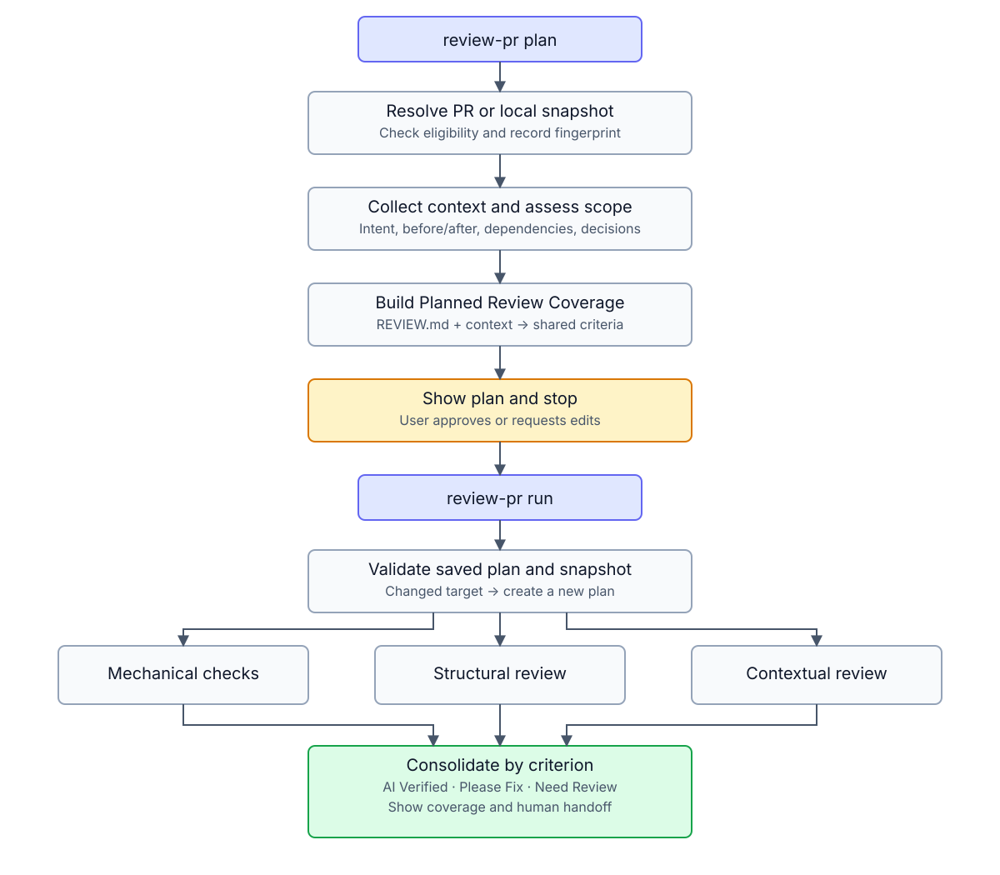

# Review PR Plugin

An evidence-based review workflow for local changes and GitHub pull requests.
The reusable plugin package lives in `plugins/review-pr/` and is exposed through
this repository's Codex marketplace manifest.

## 1. Overview

Review PR gathers relevant context, evaluates whether a change is reviewable, builds a change-specific review plan, and collects mechanical, structural, and contextual evidence for the selected review criteria.

It supports two modes:

- **Developer mode** reviews commits and working-tree changes in the current repository.
- **Reviewer mode** reviews a GitHub pull request identified by its number or URL.

## 2. Agent Compatibility

| Agent or harness | Packaging status | How to use it |
|---|---|---|
| Codex | Native | Add this repository as a marketplace, install `review-pr`, then invoke `$review-pr` or use a matching natural-language request. |
| Claude Code | Native | Load `plugins/review-pr/`, then invoke `/review-pr` or use a matching natural-language request. |
| Other coding agents | Portable skill | Import `plugins/review-pr/skills/review-pr/SKILL.md` using the agent's skill mechanism. |

## 3. Architecture

```text
review-pr/
├── .agents/
│   └── plugins/
│       └── marketplace.json
├── plugins/
│   └── review-pr/
│       ├── .codex-plugin/
│       │   └── plugin.json
│       ├── .claude-plugin/
│       │   └── plugin.json
│       ├── assets/
│       │   ├── review-pr-icon.png
│       │   └── review-workflow.svg
│       ├── agents/
│       │   └── review/
│       │       ├── mechanical.md
│       │       ├── structural.md
│       │       └── contextual.md
│       ├── skills/
│       │   └── review-pr/
│       │       ├── SKILL.md
│       │       └── checks/
│       │           ├── artifacts.md
│       │           ├── eligibility.md
│       │           └── scope.md
│       ├── REVIEW.md
│       └── LICENSE
├── PRIVACY.md
├── README.md
├── TERMS.md
└── LICENSE
```



## 4. How to Use

### Codex

Add this GitHub repository as a Codex plugin marketplace:

```bash
codex plugin marketplace add takuto-san/review-pr --ref main
```

Install the plugin:

```bash
codex plugin add review-pr@review-pr
```

Verify the installation:

```bash
codex plugin list
```

Then start a new Codex task in the repository you want to review and run:

```text
$review-pr
$review-pr 123
```

Natural-language requests are also supported:

```text
Review my local changes
Review PR 123
Review this PR: https://github.com/owner/repository/pull/123
```

To refresh the marketplace after updates:

```bash
codex plugin marketplace upgrade review-pr
```

### Claude Code

Load the plugin package directly:

```bash
claude --plugin-dir /path/to/review-pr/plugins/review-pr
```

Then run:

```text
/review-pr
/review-pr 123
```

## 5. Requirements

- A Git repository for Developer mode
- GitHub CLI (`gh`) installed and authenticated for Reviewer mode
- Access to the target repository and pull request
- Repository-defined test or analysis commands for mechanical verification

The review is read-only by default. It does not modify source files, install dependencies, change repository configuration, or post GitHub comments unless the user explicitly requests a separate action.

## 6. Features

- Developer and Reviewer modes
- Review-need validation for pull requests
- Change-specific planning based on ISO/IEC 25010 quality characteristics
- Parallel mechanical, structural, and contextual evidence collection
- Criterion-centric consolidation instead of layer-centric reporting
- Mechanical checks mapped to the review criteria they materially verify
- Result consolidation, deduplication, and targeted evidence checks for `Please Fix` candidates
- Explicit checks, evidence, coverage, and limitations
